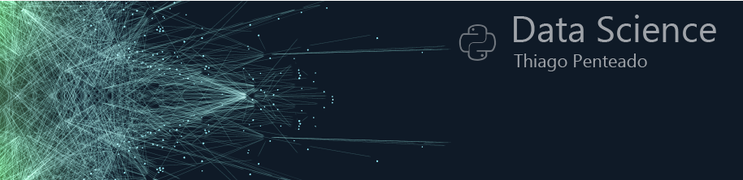

  
  
# Thiago Penteado - Mind7
Portfólio de projetos Data Science

*Futuro Cientista de Dados*

Sou formado em Publicidade e Propaganda pela Universidade Paulista em 2006, e desde então, trabalho na área do Audiovisual e Jornalismo como Operador de Camêra. Hoje trabalho na Camâra Municipal de São Paulo como Operador de Camêra Robótica.

Iniciei meus estudos em programação e cientista de dados em 2020.

**Background in:** Iniciando Python.

**Links:**
* [LinkedIn](https://www.linkedin.com/in/thiago-penteado-579b269b)
* [GitHub](https://github.com/thiago-mind7/Mind7_data_science)

## Projetos:
Veja os tutoriais publicados:

* **Sem projetos porenquanto.**
---
